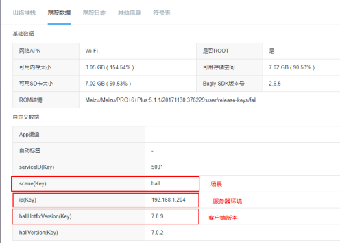

# 定位 Bugly 报错
## 技术背景
热更新方案约定，大厅、子游戏模块为“独立”工程，对模块生成热更新包时会对对“独立”工程做资源、场景合并，公共模块将必要的数据保存到全局变量，以方便其他模块使用。由于大厅、子游戏是独立模块，那么creator构建之后所有的 js、ts 代码都合并到对影子游戏的 preject.js 文件里，引擎代码合并到 cocos2d-jsb.js 中，所以在 bugly 上面看到出错的堆栈中常见 cocos2d-jsb.js、project.js 某一行出错。

## 定位方法
Bugly中错误如图：

*  跟踪数据中会指出错误发生是的场景、服务器环境和客户端版本，以此可以定位哪个模块发生错误
*  由于project.js 报错函数、堆栈、变量非常模糊，所以需要使用 [source-map 技术](index#技术分享)定位错误源，需要安装nodejs、source-map工具，资料中已经给出了安装方式，此处不再描述
*  热更包声称是缺省勾选source-map选项，会生成project.js、project.js.map，project.js.map为符号表，可用于反向定位
*  运行例子：将 project.js.map 重命名为 project.json，`node convert.js 1580 7`

## 符号表获取
请参考[热更包生成及发布流程文档](热更包生成及发布流程#发布路径)，其中给出了热更包的发布路径，所有版本、模块的符号表都存放在 src 目录下，请自行获取。