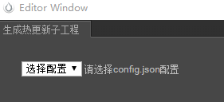
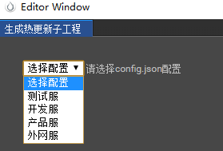
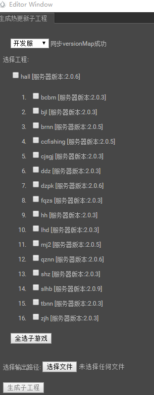
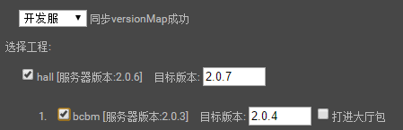
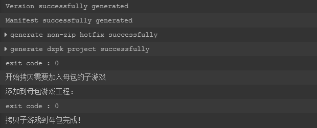

# 热更包生成及发布流程 V2.0
## 热更新工具更新说明

热更新工具 2.0 版本基于 [1.0-版本](热更包生成及发布流程-V1.0) 优化而来，基本原理不变，但优化了使用体验，减少操作步骤，特别是完全去除了人为修改配置文件的过程，尽可能避免因操作不当引起的错误，以下是优化日志：

* 自动读取当前开发环境，并自动更改 config.json 文件，不需要手动更改 config.json 文件中可执行文件和工具脚本的路径
* 增加发布环境选择，并自动更改 config.json 文件，不需要手动更改 config.json 文件中发布环境的相关配置
* 自动同步对应发布环境中的远程 versionMap.json 配置，不用再为不知道当前环境的最新版本烦恼
* 未选择发布环境时隐藏其他操作控件
* 界面增加当前发布环境服务器中对应模块的最新版本的显示
* 增加目标版本输入框，修改目标版本后自动更新 config.json 文件，不需要手动更改 config.json 文件中各模块的目标版本
* 不勾选相应模块时隐藏对应目标版本输入框，勾选时显示，并将目标版本在服务器版本的基础上加一
* 服务器上增加 syncVersionMap.py 脚本，用于自动修改服务器上的 versionMap.json 文件，避免手动修改出错
* 固定工具界面尺寸

## 1.  准备
### 更新相关SVN目录
热更包生成及发布涉及到的目录有：
*  creatorMainProj/packages/
*  devTool/

这些目录都是从 svn://192.168.1.242/app_client/branches/hotfix_dev 外链出来的。  
**使用插件生成和发布热更包前请务必先在对应工程下更新这些目录。**

### 安装 python
工具依赖 python2，推荐安装python2.7(32位)，https://www.python.org/downloads/ ，请自行安装。（好像 python3 也可以）

### 安装 nodejs
工具依赖 nodejs，推荐安装LTS版本，https://nodejs.org/en/ ，请自行安装。

## 2.  热更新插件的使用
### 入口


初次打开时界面如下：



### 生成热更新包
* **注意：2.0 版本热更新工具不要手动更改任何配置文件，直接使用 svn 上的最新版本即可**
* **注意：2.0 版本热更新工具 config.json 文件不要提交，以免造成冲突**
1. 选择发布环境：
    * 
2. 发布环境选择后界面如下：
    * 
3. 勾选发布模块：
    * 
    * 发布模块勾选后，目标版本会在服务器版本的基础上加一
4. 如果有需要可以更改目标版本
5. 如果有需要可以全选子游戏
6. 在“选择输出路径”处设置好热更包的输出路径
7. 点击“生成子工程”按钮，随后编辑器的控制台会有输出
8. 约 5 分钟左右的时间，控制台有类似以下输出则表示成功输出了热更包：
    * 
9. **生成的过程中若出现红色的报错可以咨询平台组-司马懿，有些错误可以忽略，有些不能**

### 输出目录描述
生成的热更包路径是： %输出目录%\updateProjs\update\\%游戏名称%\游戏名称_版本号.zip 

## 4. 发布热更新包
### 发布路径
使用 Xftp 工具连接服务器 192.168.1.245 的 22 号端口，用户名：root，密码：88888888 
*  开发环境发布路径为: /home/www/html/update_dev/%游戏名称%/  
*  测试环境发布路径为: /home/www/html/update/%游戏名称%/  
*  产品环境发布路径为: /home/www/html/update_product/%游戏名称%/  
### 拷贝和解压

* 使用 Xftp 工具将生成的热更包（游戏名称_版本号.zip 文件）拷贝到对应环境的发布路径下
* 使用 Xshell 工具进入到发布路径下，用 unzip 命令解压拷贝进去的热更包，若提示重名覆盖即可，操作示例如下：
    ```
    [root@localhost update_dev]# ls
    bcbm  ccfishing  dzpk  hh   qznn  syncVersionMap.py  update_2.0.5.zip
    bjl   cjsgj      fqzs  lhd  shz   tbnn               versionMap.json
    brnn  ddz        hall  mj2  slhb  update_2.0.4.zip   zjh
    [root@localhost update_dev]# unzip update_2.0.5.zip 
    Archive:  update_2.0.5.zip
    replace brnn/2.0.5/brnn.zip? [y]es, [n]o, [A]ll, [N]one, [r]ename: A
    ```

### 同步服务器中的 versionMap.json 
进入发布目录的父目录，其中有个 versionMap.json 文件用来描述大厅中子游戏更新的红点提示，其结构如下：
```
{
    "ddz": "8.0.1",  
    "lhd": "8.0.1",  
    "zjh": "8.0.1",  
    "ccfishing": "8.0.1",  
    "shz": "8.0.1",  
    "bjl": "8.0.1",  
    "bcbm": "8.0.1",  
    "hh": "8.0.1",  
    "cjsgj": "8.0.1",  
    "fqzs": "8.0.1",  
    "tbnn": "8.0.1",  
    "brnn": "8.0.1",  
    "hall": "8.0.1"  
}
```
其中 key 表示游戏名称，value 表示该游戏表示当前发布的版本。
* 其中还有个 syncVersionMap.py 脚本文件可用于同步 versionMap.json 文件，操作示例及输出如下：
    ```
    [root@localhost update_dev]# python syncVersionMap.py 
    ('bcbm', u'2.0.3')
    ('bjl', u'2.0.3')
    ('brnn', u'2.0.5')
    ('ccfishing', u'2.0.5')
    ('cjsgj', u'2.0.3')
    ('ddz', u'2.0.3')
    ('fqzs', u'2.0.3')
    ('hh', u'2.0.3')
    ('lhd', u'2.0.3')
    ('shz', u'2.0.3')
    ('tbnn', u'2.0.3')
    ('zjh', u'2.0.3')
    ('dzpk', u'2.0.6')
    ('hall', u'2.0.5')
    ('mj2', u'2.0.5')
    ('qznn', u'2.0.6')
    ('slhb', u'2.0.9')
    ('hall', u'2.0.6')
    ('saveJson', './versionMap.json')
    ```
**使用 syncVersionMap.py 即可完全同步，请避免直接修改 versionMap.json 文件，以避免造成错误。操作完后可根据命令输出的内容进一步确认发布的版本是否正确。**

## 5. 验证
* 经过以上步骤，热更新包就发布成功了
* **在测试和产品环境发布热更新和通知测试和策划人员之前，请务必首先在开发环境用安卓模拟器或手机自行验证，确认没有问题再往测试和产品环境发布**
* 若出现问题，先对照本文档检查是否有操作失误，若没有操作失误则及时将问题报告平台组
* 开发环境母包：http://192.168.1.245/download/dev/
* 测试环境母包：http://192.168.1.245/download/test/
* 产品环境母包：http://192.168.1.245/download/product/
* 需要注意的是，发布热更包时，如果有版本回退的情况，必须在手机上清除母包的缓存数据或者重新安装母包才能正常的更新到目标版本