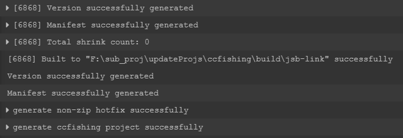

# 热更包生成及发布流程
## 1.  准备
### 更新相关SVN目录
热更包生成及发布涉及到的目录有：
*  creatorMainProj/packages/
*  devTool/

这些目录都是从 svn://192.168.1.242/app_client/branches/hotfix_dev 外链出来的。  
**使用插件生成和发布热更包前请务必先在对应工程下更新这些目录。**

### 安装 python
工具依赖 python2，推荐安装python2.7(32位)，https://www.python.org/downloads/ ，请自行安装。（好像 python3 也可以）

### 安装 nodejs
工具依赖 nodejs，推荐安装LTS版本，https://nodejs.org/en/ ，请自行安装。

## 2.  配置热更新插件
### 配置文件描述
每个工程下的 *creatorMainProj/packages/scenetools* 目录下保存有用于生成热更新包的插件，其中 *config.json* 即为热更新插件配置，其结构如下：  
```
{
    "creatorPath": "C:/CocosCreator_2.0.10/CocosCreator.exe",  
    "creatorPathMac": "/Applications/CocosCreator.app/Contents/MacOS/CocosCreator",  
    "updateUrl": "http://192.168.1.245/update_dev/",
    "versionGenScriptPath": "C:/Work/DH/app_client/branches/hotfix_dev/devTool/hotfix_tool/version_generator.js",  
    "encryptScriptPath": "C:/Work/DH/app_client/branches/hotfix_dev/devTool/encrypt_tool/encode.py",  
    "encryptEnabled":false,  
    "serverCfg":"192.168.1.243:20001",  
    "versionMap":{  
        "hall":"2.0.3",  
        "bcbm":"2.0.3",  
        "bjl":"2.0.3",  
        "brnn":"2.0.3",  
        "ccfishing":"2.0.3",  
        "cjsgj":"2.0.3",  
        "ddz":"2.0.3",  
        "fqzs":"2.0.3",  
        "hh":"2.0.3",  
        "lhd":"2.0.3",  
        "shz":"2.0.3",  
        "tbnn":"2.0.3",  
        "zjh":"2.0.3"  
    },  
    "channel":["123456@12@1"],  
    "tinyPngEnabled":false,  
    "tinyPngAPIKey":"326jHX0xSPZM7TdvRQQkMlWtk3N1Qb5Y"  
}
```
*  creatorPath 为 Windows 下编辑器可执行文件 CocosCreator.exe 的路径
*  creatorPathMac 为 MacOS 下编辑器可执行文件的路径
*  updateUrl 为存放热更包和程序检验热更新的地址
*  versionGenScriptPath 和 encryptScriptPath 为生成热更包和加密的工具
*  encryptEnabled 为是否进行加密的标志
*  serverCfg 为 socket 连接服务器的 IP 及端口
*  versionMap 分别是各个子游戏的热更新版本
*  channel 为渠道标识
*  tinyPngEnabled 为是否进行资源压缩的标志
*  tinyPngAPIKey 为使用tinyPng时需要的APIKey

### 配置规范
*  根据各自的开发环境配置 creatorPath、versionGenScriptPath、encryptScriptPath 字段
*  根据发布的需求配置 updateUrl 和 serverCfg 字段
*  根据需要配置需要发布的子游戏的热更新版本号，**注意不要随意更改无关的小游戏的版本号，只更改自己要发布的游戏即可**
*  其他配置一般情况下不需要变动

> 目前各环境的 updateUrl 和 serverCfg 为：  
开发环境 updateUrl 为 http://192.168.1.245/update_dev/ ，serverCfg 为 192.168.1.243:20001  
测试环境 updateUrl 为 http://192.168.1.245/update/ ，serverCfg 为 192.168.1.204:20001  
产品环境 updateUrl 为 http://192.168.1.245/update_product/ ，serverCfg 为 192.168.1.242:21002  
**后期的路径可能会进行调整，届时将会同步此文档。**

**注意，这个配置文件不要提交，各个项目组的客户端开发人员根据自己的发包需求进行改动即可。**

## 3.  热更新插件的使用
### 入口


打开后界面如下：


### 生成热更新包
在“选择子工程名”处选择要生成的热更新子工程，然后在“选择输出路径”处设置好热更包的输出路径，然后点击“生成子工程”按钮，随后编辑器的控制台会有输出，约5分钟左右的时间，控制台有类似以下输出则表示成功输出了热更包：



>  生成的过程中若出现报错可以咨询平台组-司马懿，有些错误可以忽略，有些不能。

### 输出目录描述
生成的热更包路径是： %输出目录%\updateProjs\update\\%游戏名称%\游戏名称_版本号.zip 

## 4. 发布热更新包
### 发布路径
使用 Xftp 工具连接服务器 192.168.1.245 的 22 号端口，用户名：root，密码：？  
*  开发环境发布路径为 /home/www/html/update_dev/%游戏名称%/  
*  测试环境发布路径为 /home/www/html/update/%游戏名称%/  
*  产品环境发布路径为 /home/www/html/update_product/%游戏名称%/  


### 拷贝和解压
使用 Xftp 工具将生成的热更包拷贝到对应环境的发布路径下，使用 Xshell 工具进入到发布路径下，用 unzip 命令解压拷贝进去的热更包，若提示重名覆盖即可。


### 更改 versionMap.json 
进入发布目录的父目录，其中有个 versionMap.json 文件用来描述大厅中子游戏更新的红点提示，其结构如下：
```
{
    "ddz": "8.0.1",  
    "lhd": "8.0.1",  
    "zjh": "8.0.1",  
    "ccfishing": "8.0.1",  
    "shz": "8.0.1",  
    "bjl": "8.0.1",  
    "bcbm": "8.0.1",  
    "hh": "8.0.1",  
    "cjsgj": "8.0.1",  
    "fqzs": "8.0.1",  
    "tbnn": "8.0.1",  
    "brnn": "8.0.1",  
    "hall": "8.0.1"  
}
```
其中 key 表示游戏名称，value 表示该游戏表示当前发布的版本，修改对应游戏的版本号为发布的版本。  

**注意不要忘记修改 versionMap.json 文件，也不要随意修改其他游戏的版本号。**

## 5. 验证
经过以上步骤，热更新包就发布成功了，在通知测试和策划人员之前请务必首先用安卓模拟器或手机自行验证，确认没有问题再告知。  
若出现问题，先对照本文档检查是否有操作失误，若没有操作失误则及时将问题报告平台组。